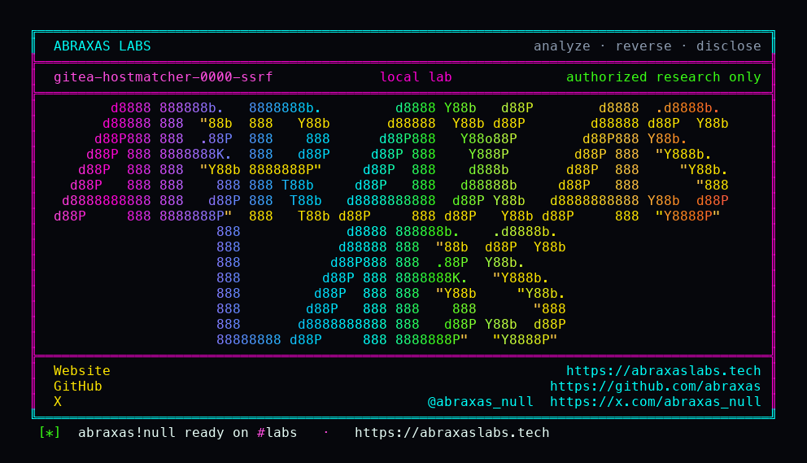

<p align="center">
  
</p>

<p align="center">
  <a href="https://abraxaslabs.tech"><strong>abraxaslabs.tech</strong></a>
  &nbsp;·&nbsp;
  <a href="https://github.com/abraxas">github.com/abraxas</a>
  &nbsp;·&nbsp;
  <a href="https://x.com/abraxas_null">@abraxas_null</a>
  &nbsp;·&nbsp;
  <a href="https://github.com/abraxas/gitea-hostmatcher-0000-ssrf">gitea-hostmatcher-0000-ssrf</a>
</p>

# gitea-hostmatcher-0000-ssrf

**Gitea** `1.27.3` - Gitea

[CVE-2026-22874](https://github.com/go-gitea/gitea/security/advisories/GHSA-2r5c-gw76-rh3w) added [`reservedIPNets`](https://github.com/go-gitea/gitea/blob/v1.27.3/modules/hostmatcher/hostmatcher.go). CGNAT, TEST-NET, NAT64, Teredo, Azure WireServer. Real ranges. Not [RFC 6890](https://datatracker.ietf.org/doc/html/rfc6890) `0.0.0.0/8`, the old "this network" block. IANA still publishes it. Go `IsGlobalUnicast` is **true** for `0.0.0.1`. It is not `IsLoopback` (`127.0.0.0/8`). It is not `IsPrivate`. The default external allow-list treats it as the public internet. Linux will deliver `0.0.0.1` to a local socket if that address is on `lo`. Same listener, two names.

**A signed-in user can webhook `http://0.0.0.1` and read the HTTP body from hook history. `127.0.0.1` on the same port is denied.**

| | |
|---|---|
| ID | no CVE yet |
| CWE | [CWE-918](https://cwe.mitre.org/data/definitions/918.html) |
| CVSS | **High: 7.7** `CVSS:3.1/AV:N/AC:L/PR:L/UI:N/S:C/C:H/I:N/A:N` |
| Product | [Gitea](https://github.com/go-gitea/gitea) |
| Affected | through **v1.27.3** (`146cc3e`); leftover of CVE-2026-22874 |
| Auth | signed-in user who can create a repo webhook |
| License | [GNU Affero GPL v3.0](LICENSE) |
| Lab | `127.0.0.1` only |

## What an attacker can do

Register (default open registration), create a repo, point a webhook at `http://0.0.0.1:<local-port>/`, test it, and read the response body from hook history. That is loopback HTTP that `127.0.0.1` on the same port cannot reach: anything listening in Gitea's netns that bound more broadly than loopback, including services the operator thought were "localhost only" because they blocked `127.0.0.0/8`.

It does not set `X-Gitea-Internal-Auth`. It is not RCE by itself. It is a full HTTP body from an address the allow-list still calls external.

## How I found it

v1.27.3 is the build that closed the 2026 GHSA wave. I sat on that tag anyway. Patches that add an allow-list or a deny-list are a gift: you read the list, then you ask what IANA still has that the list forgot. Two leftovers already had labs on this tree ([keys IDOR](https://github.com/abraxas/gitea-user-keys-idor) and [git-redirect SSRF](https://github.com/abraxas/gitea-git-redir-ssrf)). The leftover table on that post listed a webhook to `http://0.0.0.1/` as a map. This is the SUCCESS.

Webhook delivery stores the HTTP body in hook history. That is a better oracle than git clone, which is mostly "did the fetch work." I put an oracle in Gitea's netns on port 8080, added `0.0.0.1/8` on `lo` with `NET_ADMIN`, and created two webhooks. Negative control first.

Wrong turns already recorded: treating webhook create HTTP 201 as the oracle (history is the oracle); `127.0.0.1` delivery succeeding (that would be a different bug - lab requires it denied); hitting `/api/internal` with `X-Gitea-Internal-Auth`; a reverse shell. Theatre. The witness is `GITEA-0000-SSRF` in hook history.

## Lab

```bash
cd lab
./run.sh
```

Target **only** `http://127.0.0.1:18131`. Oracle shares Gitea's netns on port 8080. `run.sh` adds `0.0.0.1/8` on `lo`.

```text
create-hook name=neg-loopback status=201
negative-control 127.0.0.1 blocked
create-hook name=hit-0000 status=201
poll id=2 witness=True
SUCCESS GITEA-HOSTMATCHER-0000
```

## The fix

Add `0.0.0.0/8` to `reservedIPNets`, or stop treating `IsGlobalUnicast` as "safe to dial." `0.0.0.1` must be denied the same way `127.0.0.1` is.

## References

- [github.com/go-gitea/gitea](https://github.com/go-gitea/gitea) tag [v1.27.3](https://github.com/go-gitea/gitea/releases/tag/v1.27.3)
- [`hostmatcher.go`](https://github.com/go-gitea/gitea/blob/v1.27.3/modules/hostmatcher/hostmatcher.go)
- Nearby patched: [CVE-2026-22874](https://github.com/go-gitea/gitea/security/advisories/GHSA-2r5c-gw76-rh3w)
- [RFC 6890](https://datatracker.ietf.org/doc/html/rfc6890)
- [CWE-918](https://cwe.mitre.org/data/definitions/918.html)

## License

GNU Affero GPL v3.0. See [LICENSE](LICENSE). Loopback lab only. No warranty.
